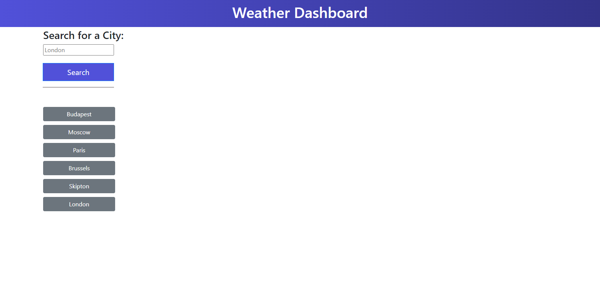

# Weather_Dashboard

## Description

This is a simple weather application that displays the current weather and a 5-day forecast for a chosen location.

## Usage

It doesn't require any installation. As a user of the website you are able to search for a city that is presented with current and future weather conditions for that city and the city is added to the search history as a button under the search bar area. When the user views the current weather conditions for the chosen city they are able to see the city name, the current date, an icon that represents the current weather conditions, the temperature, the humidity level and the wind speed. When the user looks at the future weather conditions for that location they are presented with a 5-day forecast that displays the dates, the icon representation of the weather conditions, the tempreature, the humidity level and the wind speed. When the user clicks on the button with the name of the selected city they are again presented with the current and future conditions for that city. When the user refreshes the page the current weather datas and the forecast disappears but the buttons with city names stay visible.

Please see a mockup image of the website below before searching:

 

 
And here is another one after searching:
 

 

 
Here is the link for the deployed webpage: https://vighimre87.github.io/Weather_Dashboard/

## Technologies

HTML, CSS, JavaScript, Bootstrap 4, Moment JS, JQuery.

## Credits

N/A
 

## License

Plese refer to the LICENSE file in the repo.